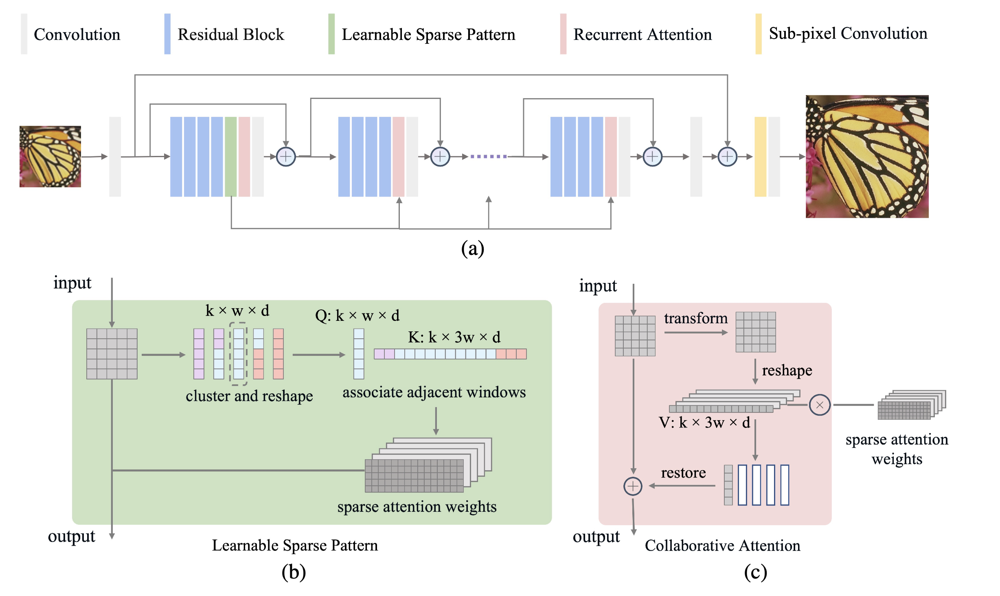

# Efficient Learnable Collaborative Attention for Single Image Super-Resolution
This project is for LCoAN introduced in the following paper "Efficient Learnable Collaborative Attention for Single Image Super-Resolution".

The code is test on Ubuntu 20.04 environment (Python3.7, PyTorch >= 1.12.0) with Nvidia 3090 GPUs. 
## Contents
1. [Introduction](#introduction)
2. [Train](#train)
3. [Test](#test)
4. [Acknowledgements](#acknowledgements)

## Introduction

Non-Local Attention (NLA) is a powerful technique for capturing long-range feature correlations in deep single image super-resolution (SR). However, NLA suffers from high computational complexity and memory consumption, as it requires aggregating all non-local feature information for each query response and recalculating the similarity weight distribution for different abstraction levels of features. To address these challenges, we propose a novel Learnable Collaborative Attention (LCoA) that introduces inductive bias into non-local modeling. Our LCoA consists of two components: Learnable Sparse Pattern (LSP) and Collaborative Attention (CoA). LSP uses the k-means clustering algorithm to dynamically adjust the sparse attention pattern of deep features, which reduces the number of non-local modeling rounds compared with existing sparse solutions. CoA leverages the sparse attention pattern and weights learned by LSP, and co-optimizes the similarity matrix across different abstraction levels, which avoids redundant similarity matrix calculations. The experimental results show that our LCoA can reduce the non-local modeling time by about 83% in the inference stage. In addition, we integrate our LCoA into a deep Learnable Collaborative Attention Network (LCoAN), which achieves competitive performance in terms of inference time, memory consumption, and reconstruction quality compared with other state-of-the-art SR methods.

The structure of our Learnable Collaborative Attention Network (LCoAN). The LCoAN is built upon a deep residual network that incorporates Learnable Sparse Pattern (LSP) and the Collaborative Attention (CoA), and the sparsity pattern and attention weights optimized by the LSP are co-optimized by all CoA.

## Train
### Prepare training data 

1. Download the training data (800 training + 100 validtion images) from [DIV2K dataset](https://data.vision.ee.ethz.ch/cvl/DIV2K/) or [SNU_CVLab](https://cv.snu.ac.kr/research/EDSR/DIV2K.tar).

2. Unzip the training data into the folder '../SrTrainingData'.

3. Specify '--dir_data' based on the HR and LR images path. 

For more informaiton, please refer to [EDSR(PyTorch)](https://github.com/thstkdgus35/EDSR-PyTorch).

### Begin to train

1. Cd to 'src', run the following script to train models.

    ```bash
    # X2 SR
    python main.py --epochs 1500 --model LCoAN --save LCoAN_x2 --data_test Set5 --save_dir ../output/ --dir_data ../../SrTrainingData --n_GPUs 1 --n_threads 8 --rgb_range 1 --save_models --save_results --lr 1e-4 --decay 300-600-900-1200 --chop --n_resgroups 10 --n_resblocks 4 --reduction 1 --n_feats 128 --n_clusters 128 --window_size 384 --ema_decay 0.999 --res_scale 0.1 --batch_size 16 --scale 2 --patch_size 96 --data_train DIV2K --data_range 1-800/1-5
    # X4 SR
    python main.py --epochs 500 --model LCoAN --save LCoAN_x4 --data_test Set5 --save_dir ../output/ --dir_data ../../SrTrainingData --n_GPUs 1 --n_threads 8 --rgb_range 1 --save_models --save_results --lr 1e-4 --decay 100-200-300-400 --chop --n_resgroups 10 --n_resblocks 4 --reduction 1 --n_feats 128 --n_clusters 128 --window_size 384 --ema_decay 0.999 --res_scale 0.1 --batch_size 16 --scale 4 --patch_size 192 --data_train DIV2K --data_range 1-800/1-5 --pre_train ../LCoAN_x2.pt
   ```

## Test
### Quick start
1. Download benchmark datasets from [SNU_CVLab](https://cv.snu.ac.kr/research/EDSR/benchmark.tar)

1. (optional) Download pretrained models for our paper.

    All the models can be downloaded from [Google Drive](https://drive.google.com/drive/folders/1oItCWGnYkxlT_ANpod4FLNtk8MQ3LFyM?usp=drive_link) 

2. Cd to 'src', run the following scripts.

    ```bash
    # X4 SR
    python main.py --model LCoAN --save LCoAN_x4 --data_test Set5+Set14+B100+Urban100+Manga109 --save_dir ../output/test/ --dir_data ../../SrTrainingData --n_GPUs 1 --n_threads 8 --rgb_range 1 --save_results --lr 1e-4 --decay 300-600-900-1200 --chop --n_resgroups 10 --n_resblocks 4 --reduction 1 --n_feats 128 --n_clusters 128 --window_size 384 --ema_decay 0.999 --res_scale 0.1 --batch_size 16 --scale 4 --patch_size 96 --data_train DIV2K --data_range 1-800/1-5  --pre_train ../LCoAN_x4.pt --test_only
   ```
## Acknowledgements
This code is built on [EDSR](https://github.com/sanghyun-son/EDSR-PyTorch) and [NLSN](https://github.com/HarukiYqM/Non-Local-Sparse-Attention). We thank the authors for sharing their codes.